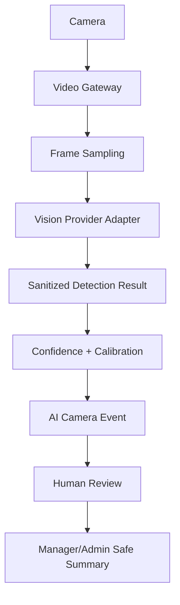

# Real AI Vision Integration

Gan Batuach now has a production-ready computer vision integration layer for the Digital Observer. This phase prepares real local engines such as OpenCV, YOLO, Ultralytics, and private local HTTP models while keeping the product in safe shadow mode.

## Safety Defaults

- No automatic accusations.
- No autonomous disciplinary decisions.
- Human review is required for every detection.
- Parent-facing raw AI events remain hidden.
- No face recognition or child identity recognition.
- No staff scoring.
- No raw RTSP URLs, camera credentials, or gateway secrets are exposed.
- Raw frames are not stored by default.

## Architecture



## Provider Layer

Provider abstraction lives in:

- `lib/domain/vision-provider.ts`
- `lib/domain/vision-analysis-pipeline.ts`

Supported provider keys:

- `local_mock`
- `opencv`
- `yolo`
- `ultralytics`
- `local_http`
- `custom`

The provider registry is stored in `vision_provider_registry`. `local_mock` is the safe default and does not process real frames. Real providers require worker runtime setup and still remain in shadow mode.

## Frame Analysis Pipeline

The database foundation includes:

- `vision_frame_analysis_jobs`
- `vision_detection_results`
- `vision_diagnostics`
- `vision_calibration_feedback`

The pipeline stores sanitized readiness and detection metadata only. The default frame source is `mock_frame`; future gateway snapshots can use `gateway_snapshot` without exposing the source stream to the browser.

## Detection Categories

Supported categories:

- `person_detected`
- `multiple_persons_detected`
- `occupancy`
- `restricted_area_presence`
- `unusual_activity`
- `object_presence`
- `obstruction_detection`
- `camera_blocked`
- `camera_frozen`
- `camera_offline`

All wording should remain careful: suspected, indicator, requires review.

## Confidence Model

Confidence is split into four parts:

- Model confidence
- Review confidence
- Learning confidence
- Correlation confidence

The combined confidence is intentionally conservative. Before human review it is capped lower. Review outcomes calibrate confidence:

- Confirmed/escalated: small confidence increase.
- Needs more data: slight decrease.
- Dismissed/false positive: confidence decrease.

The calibration records live in `vision_calibration_feedback` and can feed the Advanced Learning Engine later.

## Diagnostics

Admin route:

- `/dashboard/admin/vision-ai`

It shows:

- Provider status
- Detection volume
- False positive trends
- Average confidence
- Latency
- Processing time
- Model health

Manager route:

- `/dashboard/garden/vision-ai`

It shows only reviewed/safe detection summaries and recommendations. It does not show raw model internals or provider payloads.

## Environment Variables

Server-only:

```env
VISION_PROVIDER=local_mock
LOCAL_VISION_PROVIDER=local_mock
LOCAL_VISION_ENABLED=false
LOCAL_VISION_ENDPOINT=
CUSTOM_VISION_ENDPOINT=
VISION_SHADOW_MODE=true
VISION_HUMAN_REVIEW_REQUIRED=true
```

No external AI provider is required for this phase.

## Rollout Strategy

1. Start with `local_mock`.
2. Enable a local worker in shadow mode.
3. Connect gateway snapshot sampling.
4. Test OpenCV/YOLO on non-sensitive test footage.
5. Record false positives and confirmed detections.
6. Calibrate confidence thresholds.
7. Keep manager/admin review mandatory.
8. Only after legal/privacy review, consider broader reviewed summaries.

## Privacy Boundaries

- No child profiling.
- No staff scoring.
- No biometric assumptions.
- No parent raw AI access.
- No automatic escalation to parents.
- Human review remains the source of truth.

## Remaining Work For Real Models

- Add worker runtime with OpenCV/YOLO dependencies.
- Connect MediaMTX/go2rtc snapshot fetch.
- Add secure short-lived frame access for workers only.
- Implement real provider adapters.
- Add model versioning and rollout controls.
- Build operational runbooks for false positive review.
